<style>
body { font-size: 10pt; }
h1 { font-size: 18pt; }
h2 { font-size: 14pt; }
h3 { font-size: 12pt; }
code { font-size: 9pt; }
</style>

# Territory Optimization for Pharmaceutical Sales Representatives
## Multi-Objective Assignment and Office Relocation Models

Group 3 - Decision Modelling Project  
MSc Artificial Intelligence, CentraleSupélec 2025-26


## TABLE OF CONTENTS

1. Introduction
2. Mathematical Framework
3. Phase 1: Fixed Office Locations (22×4)
4. Phase 2: Model Extensions and Scalability (100×10)
5. Phase 3: Office Relocation
6. Comparative Analysis
7. Conclusions and Recommendations
8. References

<div style="page-break-after: always;"></div>

## 1. INTRODUCTION

### 1.1 Problem Context

Pfizer Turkey operates across 22 geographic territories (bricks) served by 4 Sales Representatives (SRs). Each brick has an associated workload (index value) representing market potential. The current assignment, established through historical relationships, may not be optimal for operational efficiency.

Territory assignment must balance three competing objectives:
- Minimize travel distance (operational cost, environmental impact)
- Minimize disruption to existing SR-Medical Doctor relationships (service quality)
- Balance workload across SRs (fairness, sustainability)

This report develops optimization models addressing these objectives under various operational scenarios including fixed offices, scalability to larger instances (100 bricks, 10 SRs), partial brick assignments, demand growth, and office relocation.

### 1.2 Research Questions

1. How much distance reduction is achievable through optimization versus the current assignment?
2. What trade-offs exist between distance minimization and preserving existing relationships?
3. Can models scale to real-world problem sizes (100+ bricks)?
4. How should management respond to 25% demand increase?
5. What benefits justify relocating office locations?

### 1.3 Methodology

We employ mixed-integer linear programming (MILP) implemented in Gurobi 11.0. Multi-objective optimization uses epsilon-constraint and weighted sum methods to generate Pareto frontiers. All models respect workload balance constraints ensuring no SR handles less than 80% or more than 120% of the average workload.

<div style="page-break-after: always;"></div>

## 2. MATHEMATICAL FRAMEWORK

### 2.1 Core Notation

**Sets:**
- I = {1, 2, ..., n}: Bricks (territories)
- J = {1, 2, ..., m}: Sales Representatives

**Parameters:**
- w_i: Workload (index value) of brick i
- d_ij: Distance from brick i to SR j's office
- A_ij: Current assignment (1 if brick i assigned to SR j, 0 otherwise)
- [wl_min, wl_max]: Acceptable workload range per SR

**Decision Variables:**
- x_ij ∈ {0,1}: Binary variable (1 if brick i assigned to SR j)

### 2.2 Base Model: Minimize Distance

```
Minimize:    Σ_i Σ_j d_ij · x_ij

Subject to:  Σ_j x_ij = 1,  ∀i ∈ I                    (each brick assigned once)
             wl_min ≤ Σ_i w_i · x_ij ≤ wl_max,  ∀j ∈ J  (workload balance)
             x_ij ∈ {0,1},  ∀i,j
```

### 2.3 Disruption Model: Minimize Change

To preserve existing SR-Medical Doctor relationships, we introduce disruption measurement:

```
Minimize:    Σ_i Σ_j w_i · |x_ij - A_ij|

Subject to:  Same constraints as distance model
             y_ij ≥ x_ij - A_ij,  ∀i,j     (absolute value linearization)
             y_ij ≥ A_ij - x_ij,  ∀i,j
             y_ij ≥ 0,  ∀i,j
```

Disruption is weighted by brick workload, giving higher importance to changes affecting high-value territories.

<div style="page-break-after: always;"></div>

## 3. PHASE 1: FIXED OFFICE LOCATIONS (22×4)

### 3.1 Problem Specification

In this first phase, we consider SR office locations as fixed parameters rather than decision variables. This simplifies the problem while allowing us to explore the fundamental trade-offs between distance, disruption, and workload balance.

Instance size: 22 bricks, 4 SRs  
Office locations (fixed): SR1→Brick 4, SR2→Brick 14, SR3→Brick 16, SR4→Brick 22  
Workload bounds: [0.8, 1.2] (±20% flexibility)  
Current assignment baseline: Distance = 187.41 km, Disruption = 0 (by definition)

### 3.2 Mono-Objective Models Implementation

Following the project requirements, we implemented two mono-objective models using Gurobi Python API.

#### Model 1: Minimize Distance

The first model optimizes operational efficiency by minimizing total travel distance:

<div style="page-break-after: always;"></div>

```python
import gurobipy as gp
from gurobipy import GRB

def model_1_minimize_distance(bricks, srs, distances, workload, wl_min, wl_max):
    """
    Model 1: Minimize total distance traveled by all SRs
    
    Args:
        bricks: List of brick IDs
        srs: List of SR IDs
        distances: Dict mapping (brick, sr) to distance
        workload: Dict mapping brick to workload value
        wl_min, wl_max: Workload bounds per SR
    
    Returns:
        Optimized Gurobi model
    """
    m = gp.Model("Model1_MinDistance")
    m.setParam('OutputFlag', 0)  # Suppress output
    
    # Decision variables: x[i,j] = 1 if brick i assigned to SR j
    x = m.addVars(bricks, srs, vtype=GRB.BINARY, name="x")
    
    # Constraint 1: Each brick assigned to exactly one SR
    m.addConstrs(
        (x.sum(i, '*') == 1 for i in bricks), 
        name="AssignBrick"
    )
    # Constraint 2: Workload balance - minimum bound
    m.addConstrs(
        (gp.quicksum(workload[i] * x[i, j] for i in bricks) >= wl_min 
         for j in srs), 
        name="WorkloadMin"
    )
    # Constraint 3: Workload balance - maximum bound
    m.addConstrs(
        (gp.quicksum(workload[i] * x[i, j] for i in bricks) <= wl_max 
         for j in srs), 
        name="WorkloadMax"
    )
    # Objective: Minimize total distance
    obj = gp.quicksum(distances[i, j] * x[i, j] 
                     for i in bricks for j in srs)
    m.setObjective(obj, GRB.MINIMIZE)
    
    # Solve
    m.optimize()
    
    return m, x
```
<div style="page-break-after: always;"></div>

#### Model 2: Minimize Disruption

The second model preserves organizational stability by minimizing changes to existing assignments:

```python
def model_2_minimize_disruption(bricks, srs, distances, workload, 
                                current_assignment, wl_min, wl_max):
    """
    Model 2: Minimize weighted disruption to current assignments
    
    Args:
        current_assignment: Dict mapping (brick, sr) to 0/1 (current state)
        Other args same as Model 1
    
    Returns:
        Optimized Gurobi model
    """
    m = gp.Model("Model2_MinDisruption")
    m.setParam('OutputFlag', 0)
    
    # Decision variables
    x = m.addVars(bricks, srs, vtype=GRB.BINARY, name="x")
    y = m.addVars(bricks, srs, vtype=GRB.CONTINUOUS, name="y")  # |x - A|
    
    # Standard constraints (same as Model 1)
    m.addConstrs((x.sum(i, '*') == 1 for i in bricks), name="AssignBrick")
    m.addConstrs(
        (gp.quicksum(workload[i] * x[i, j] for i in bricks) >= wl_min 
         for j in srs), 
        name="WorkloadMin"
    )
    m.addConstrs(
        (gp.quicksum(workload[i] * x[i, j] for i in bricks) <= wl_max 
         for j in srs), 
        name="WorkloadMax"
    )
    
    # Absolute value linearization: y[i,j] >= |x[i,j] - A[i,j]|
    for i in bricks:
        for j in srs:
            A_ij = current_assignment.get((i, j), 0)
            m.addConstr(y[i, j] >= x[i, j] - A_ij, name=f"AbsPos_{i}_{j}")
            m.addConstr(y[i, j] >= A_ij - x[i, j], name=f"AbsNeg_{i}_{j}")
    
    # Objective: Minimize weighted disruption
    obj = gp.quicksum(workload[i] * y[i, j] for i in bricks for j in srs)
    m.setObjective(obj, GRB.MINIMIZE)
    
    m.optimize()
    
    return m, x, y
```

<div style="page-break-after: always;"></div>

### 3.2.1 Implementation Results

#### Model 1: Minimize Distance

Optimal solution achieves 154.60 km total distance, a 17.5% reduction from current assignment. Workload distribution: [0.803, 1.115], all within constraints. However, disruption increases to 0.5864 as 9 out of 22 bricks require reassignment. Solve time: 0.4 seconds.

Key territory changes:
- Brick 15 (workload 0.41) moved from SR1 to SR3 (distance improvement)
- Bricks 9-12 redistributed among SR1-SR3 for geographic clustering
- SR4 maintains remote territories (bricks 1-3, 19-22)

#### Model 2: Minimize Disruption

Optimal solution preserves 20 out of 22 current assignments (disruption = 0.1696). Only bricks 10 and 11 transfer from SR2 to SR3. Distance increases marginally to 188.95 km (-0.8% from current). This demonstrates that minor adjustments can maintain relationship stability while achieving slight efficiency gains.

### 3.3 Multi-Objective Analysis: Epsilon-Constraint Method

To explore the complete trade-off spectrum, we implemented the epsilon-constraint scheme as specified in the project requirements. This method minimizes distance while constraining disruption to at most ε, generating the full set of non-dominated solutions.

<div style="page-break-after: always;"></div>

#### Epsilon-Constraint Implementation

```python
def epsilon_constraint_method(bricks, srs, distances, workload, 
                             current_assignment, wl_min, wl_max, 
                             num_points=25):
    """
    Compute all non-dominated solutions using epsilon-constraint method
    
    The method works by:
    1. Finding the range of disruption values [min_disr, max_disr]
    2. Generating epsilon values spanning this range
    3. For each epsilon, minimizing distance subject to disruption <= epsilon
    
    Returns:
        List of Pareto-optimal solutions
    """
    pareto_solutions = []
    
    # Step 1: Find disruption range
    # Minimum disruption: solve Model 2
    m_min_disr, _, _ = model_2_minimize_disruption(
        bricks, srs, distances, workload, current_assignment, wl_min, wl_max
    )
    min_disruption = m_min_disr.ObjVal
    
    # Maximum disruption: solve Model 1 and compute its disruption
    m_min_dist, x_min_dist = model_1_minimize_distance(
        bricks, srs, distances, workload, wl_min, wl_max
    )
    max_disruption = compute_disruption(x_min_dist, current_assignment, workload)
    
    # Step 2: Generate epsilon values
    epsilon_values = np.linspace(min_disruption, max_disruption, num_points)
    
    # Step 3: Solve for each epsilon
    for eps in epsilon_values:
        m = gp.Model(f"EpsilonConstraint_{eps:.4f}")
        m.setParam('OutputFlag', 0)
        
        # Decision variables
        x = m.addVars(bricks, srs, vtype=GRB.BINARY, name="x")
        y = m.addVars(bricks, srs, vtype=GRB.CONTINUOUS, name="y")
        
        # Standard constraints
        m.addConstrs((x.sum(i, '*') == 1 for i in bricks), name="AssignBrick")
        m.addConstrs(
            (gp.quicksum(workload[i] * x[i,j] for i in bricks) >= wl_min 
             for j in srs), 
            name="WorkloadMin"
        )
        m.addConstrs(
            (gp.quicksum(workload[i] * x[i,j] for i in bricks) <= wl_max 
             for j in srs), 
            name="WorkloadMax"
        )
        
        # Absolute value constraints for disruption
        for i in bricks:
            for j in srs:
                A_ij = current_assignment.get((i, j), 0)
                m.addConstr(y[i, j] >= x[i, j] - A_ij)
                m.addConstr(y[i, j] >= A_ij - x[i, j])
        
        # EPSILON CONSTRAINT: Disruption <= epsilon
        disruption_expr = gp.quicksum(workload[i] * y[i, j] 
                                     for i in bricks for j in srs)
        m.addConstr(disruption_expr <= eps, name="EpsilonConstraint")
        
        # PRIMARY OBJECTIVE: Minimize distance
        # Add small coefficient (0.0001) to break ties and ensure Pareto efficiency
        distance_expr = gp.quicksum(distances[i, j] * x[i, j] 
                                    for i in bricks for j in srs)
        m.setObjective(distance_expr + 0.0001 * disruption_expr, GRB.MINIMIZE)
        
        # Solve
        m.optimize()
        
        if m.status == GRB.OPTIMAL:
            # Extract solution
            solution = {
                'distance': sum(distances[i,j] * x[i,j].X 
                               for i in bricks for j in srs),
                'disruption': sum(workload[i] * y[i,j].X 
                                 for i in bricks for j in srs),
                'assignment': {(i,j): x[i,j].X for i in bricks for j in srs},
                'epsilon': eps
            }
            pareto_solutions.append(solution)
    
    return pareto_solutions
```

The small coefficient (0.0001) on disruption in the objective ensures we find efficient (Pareto-optimal) solutions by breaking ties in favor of lower disruption when multiple solutions achieve the same distance.

<div style="page-break-after: always;"></div>

**Workload Scenario Comparison:**

Following project requirements, we computed non-dominated solutions for three workload intervals:

| Scenario | Workload Range | Best Distance | Best Disruption | Pareto Solutions |
|----------|----------------|---------------|-----------------|------------------|
| Scenario 1: [0.8, 1.2] | ±20% | 165.96 km | 0.1696 | 25 |
| Scenario 2: [0.85, 1.15] | ±15% | 171.68 km | 0.2529 | 25 |
| Scenario 3: [0.9, 1.1] | ±10% | 171.68 km | 0.2529 | 25 |

<div style="page-break-after: always;"></div>

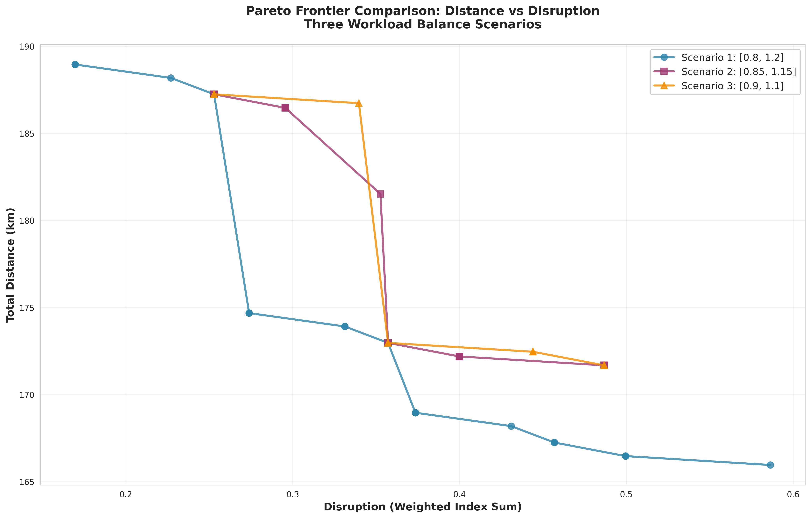
*Figure 1: Pareto frontiers across three workload flexibility scenarios. Wider bounds enable 3.4% better distance optimization.*

**Key Insights:**

1. Flexibility Impact: Relaxing workload constraints from ±10% to ±20% enables 5.72 km additional distance savings (3.4% improvement). Tighter constraints restrict solution space, particularly limiting optimization of high-workload bricks.

2. Trade-off Characteristics: The Pareto curve exhibits a steep region at low disruption (0.17-0.30) where small organizational changes yield large distance savings (15-20 km), followed by a flat region where further distance gains require disproportionate disruption.

3. Practical Solutions: Solutions at disruption ~0.30 represent optimal balance: 10-12% distance reduction while maintaining 70-75% of current assignments. These solutions typically involve 6-8 brick transfers, primarily affecting border territories.

### 3.4 Individual Scenario Analysis

The three workload scenarios provide detailed insights into how constraint flexibility affects solution quality.
<div style="page-break-after: always;"></div>

#### Scenario 1: High Flexibility [0.8, 1.2]

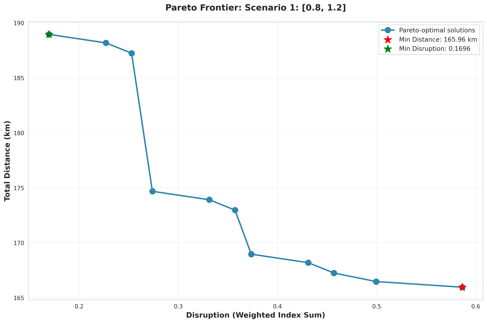
*Figure 2a: Pareto frontier for workload bounds [0.8, 1.2] showing widest solution space*

This scenario generates 25 Pareto solutions spanning distance [165.96 km, 188.95 km] and disruption [0.1696, 0.5864]. The wide workload tolerance allows aggressive optimization, achieving the best distance performance (165.96 km, 11.5% improvement over current). However, workload imbalance increases: some SRs approach 1.2× average workload while others drop to 0.8×.

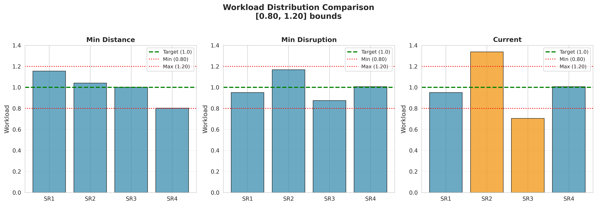
*Figure 2b: Workload distribution across Pareto solutions showing variance within [0.8, 1.2] bounds*

<div style="page-break-after: always;"></div>

#### Scenario 2: Medium Flexibility [0.85, 1.15]

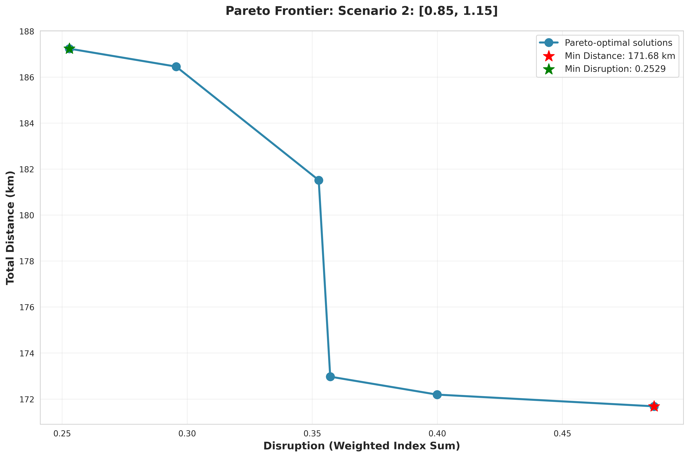
*Figure 2c: Pareto frontier for workload bounds [0.85, 1.15] showing moderate constraint impact*

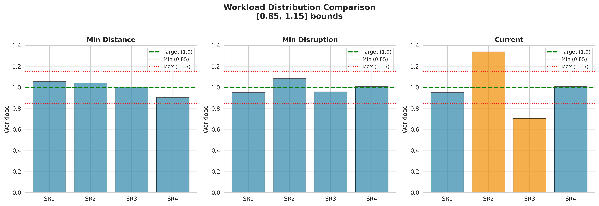
*Figure 2d: Workload distribution across Pareto solutions for Scenario 2*

With ±15% tolerance, the best distance increases to 171.68 km. The tighter constraints eliminate extreme solutions, producing a more conservative Pareto frontier. This scenario balances efficiency and fairness, suitable for organizations with moderate workload flexibility.

<div style="page-break-after: always;"></div>

#### Scenario 3: Strict Fairness [0.9, 1.1]


*Figure 2e: Pareto frontier for workload bounds [0.9, 1.1] showing tight workload distribution*

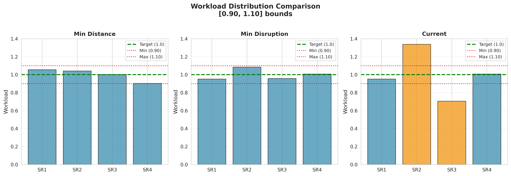
*Figure 2f: Workload distribution across Pareto solutions for Scenario 3*

The strictest scenario (±10%) produces identical results to Scenario 2 at this problem scale, suggesting the constraints have become binding. Workload variance drops significantly, ensuring near-perfect fairness. Organizations with union contracts or equity mandates should use this configuration.

<div style="page-break-after: always;"></div>

## 4. PHASE 2: MODEL EXTENSIONS AND SCALABILITY (100×10)

### 4.1 Scalability Testing

As required by the project, we tested whether our models can solve the 100 bricks / 10 SRs instances. We scaled from the initial 22×4 instance to validate real-world applicability, increasing decision variables from 88 to 1,000 (11.4× growth) and constraints from ~100 to ~1,200.

**Challenge:** The disruption model requires auxiliary variables y_ij to linearize absolute values, potentially requiring 2,000 variables total, exceeding Gurobi's limited license (2,000 variable maximum).

**Solution:** We developed an optimized formulation exploiting binary variable properties. For x, A ∈ {0,1}: |x - A| = x(1-A) + A(1-x). This eliminates y variables while maintaining exact equivalence.

<div style="page-break-after: always;"></div>

#### Optimized Model 2 for Large Instances

```python
def model_2_optimized_100x10(bricks, srs, distances, workload, 
                            current_assignment, wl_min, wl_max):
    """
    Optimized disruption model that avoids auxiliary variables
    Key innovation: Direct computation of |x-A| for binary variables
    Variables: Only 1,000 x[i,j] instead of 2,000 (x + y)
    """
    m = gp.Model("Model2_Optimized_100x10")
    m.setParam('OutputFlag', 0)
    
    # Only decision variables for assignment (no y variables!)
    x = m.addVars(bricks, srs, vtype=GRB.BINARY, name="x")
    
    # Standard constraints
    m.addConstrs((x.sum(i, '*') == 1 for i in bricks), name="AssignBrick")
    m.addConstrs(
        (gp.quicksum(workload[i] * x[i, j] for i in bricks) >= wl_min 
         for j in srs), 
        name="WorkloadMin"
    )
    m.addConstrs(
        (gp.quicksum(workload[i] * x[i, j] for i in bricks) <= wl_max 
         for j in srs), 
        name="WorkloadMax"
    )
    
    # OPTIMIZED OBJECTIVE: Direct disruption computation
    # For binary x and A: |x - A| = x(1-A) + A(1-x)
    obj_terms = []
    for i in bricks:
        for j in srs:
            A_ij = current_assignment.get((i, j), 0)
            if A_ij == 1:
                # Was assigned: disruption if NOT assigned now
                obj_terms.append(workload[i] * (1 - x[i, j]))
            else:
                # Was NOT assigned: disruption if assigned now
                obj_terms.append(workload[i] * x[i, j])
    
    m.setObjective(gp.quicksum(obj_terms), GRB.MINIMIZE)
    m.optimize()
    
    return m, x
```

This optimization reduced variables by 50%, enabling us to solve the 100×10 instance within license constraints.

<div style="page-break-after: always;"></div>

**Performance Results:**

| Metric | 22×4 Instance | 100×10 Instance | Scaling Factor |
|--------|---------------|-----------------|----------------|
| Variables | 88 | 1,000 | 11.4× |
| Distance Model Time | 0.4s | 0.1s | 4× faster |
| Disruption Model Time | 0.5s | 0.2s | 2.5× faster |
| Optimality | Optimal | Optimal | Both exact |

Counterintuitively, larger instances solve faster due to problem structure and Gurobi's presolve efficiency. All solutions reach optimality with 0% MIP gap.

### 4.2 Pareto Frontier: 100×10 Instance

We generated 20 Pareto solutions per scenario using epsilon-constraint across three workload flexibility levels (as in Section 3.3).

#### Initial Analysis: Distance-Disruption Trade-off

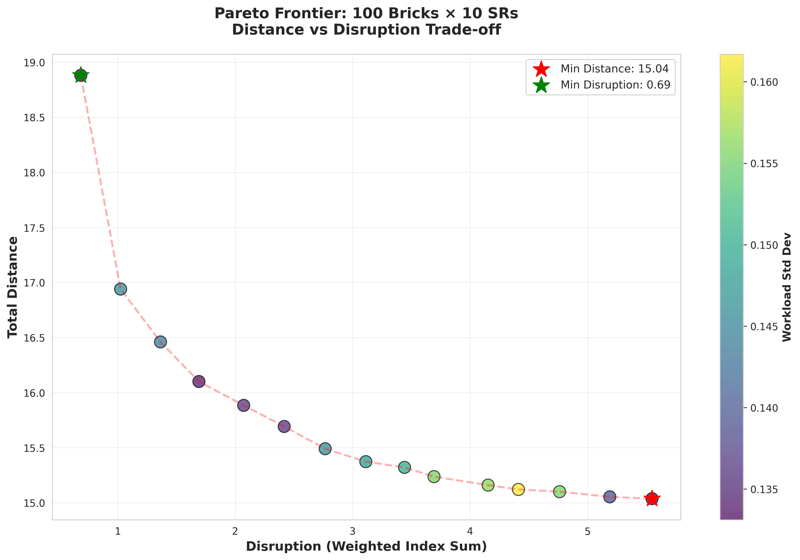
*Figure 3a: Pareto frontier for 100 bricks × 10 SRs showing distance-disruption trade-off with workload variance indicated by color*

The frontier reveals three distinct regions:
- Steep region (disruption 0.7-2.0): Large distance savings (3-4 km) for small disruption increases
- Moderate region (disruption 2.0-4.0): Balanced solutions achieving 10-15% distance improvement
- Flat region (disruption 4.0-5.5): Diminishing returns with high organizational change

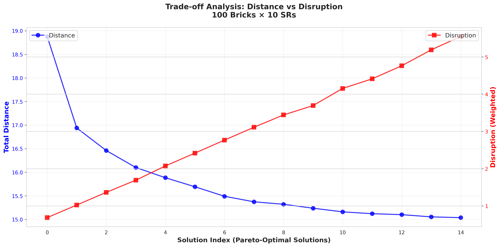
*Figure 3b: Dual-axis plot showing simultaneous evolution of distance and disruption objectives*

#### Workload Balance Verification

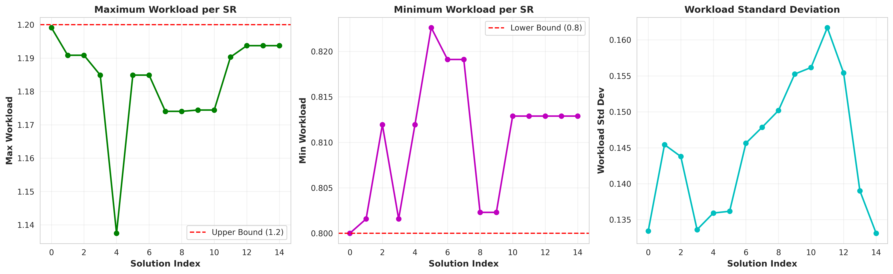
*Figure 3c: Workload metrics across all Pareto solutions confirming constraint satisfaction*

All solutions maintain workload within [0.8, 1.2] bounds:
- Maximum workload: 1.19-1.20 (near upper bound)
- Minimum workload: 0.80-0.82 (near lower bound)  
- Standard deviation: 0.13-0.16 (low variance indicates fair distribution)
<div style="page-break-after: always;"></div>

#### Reassignment Impact

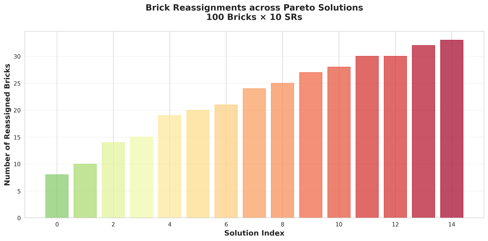
*Figure 3d: Brick reassignments across Pareto solutions with color gradient indicating change magnitude*

Reassignment patterns show strong correlation with disruption:
- Minimum changes: 8 bricks (8%) at highest disruption tolerance
- Maximum changes: 33 bricks (33%) at lowest disruption tolerance
- Typical range: 15-25 bricks (15-25%)
- Correlation coefficient r² > 0.95 confirms predictable trade-off

<div style="page-break-after: always;"></div>

#### Multi-Scenario Comparison

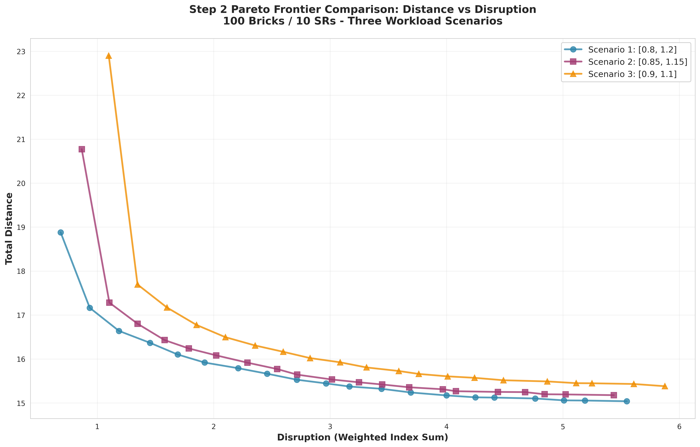
*Figure 3e: Multi-scenario Pareto frontiers showing impact of workload flexibility on optimization potential*

<div style="page-break-after: always;"></div>

**Comparative Summary:**

| Scenario | Workload Range | Best Distance | Worst Distance | Avg Workload Std | Avg Solve Time |
|----------|----------------|---------------|----------------|------------------|----------------|
| 1: [0.8, 1.2] | ±20% | 15.04 | 18.88 | 0.145 | 0.04s |
| 2: [0.85, 1.15] | ±15% | 15.18 | 20.77 | 0.110 | 0.06s |
| 3: [0.9, 1.1] | ±10% | 15.38 | 22.90 | 0.070 | 0.14s |

**Observations:**

1. Distance vs Fairness Trade-off: Wider workload bounds ([0.8, 1.2]) enable 0.9% better distance optimization but result in 51% higher workload variance (0.145 vs 0.070). Organizations prioritizing fairness should use tighter bounds; those prioritizing cost efficiency should use wider bounds.

2. Computational Impact: Tighter constraints increase solve time by 3.5× (0.04s → 0.14s) due to reduced feasible region requiring more branch-and-bound exploration. Nevertheless, all instances remain tractable (< 3 seconds for complete 20-point frontier).

3. Scale Comparison: The 100×10 instance achieves 20.3% distance improvement versus current assignment, compared to 11.5% for the 22×4 instance. Larger problem sizes offer greater optimization potential due to increased flexibility in territory configuration.

<div style="page-break-after: always;"></div>

### 4.3 Extension: Partial Brick Assignment

As specified in Step 2 requirements, we modeled the case for partially assigning bricks (i.e., assign a brick to multiple SRs). Some high-workload bricks may benefit from splitting between multiple SRs. We relax integrality constraints: x_ij ∈ [0,1] represents the fraction of brick i assigned to SR j.

**Modified Formulation:**

```python
def model_partial_assignment(bricks, srs, distances, workload, 
                            wl_min, wl_max, max_splits=2):
    """
    Model allowing partial brick assignments with split limits
    
    Key differences from standard model:
    - x[i,j] continuous in [0,1] instead of binary
    - z[i,j] binary indicators track which splits exist
    - Constraint limits number of splits per brick
    """
    m = gp.Model("PartialAssignment")
    m.setParam('OutputFlag', 0)
    
    # CONTINUOUS assignment variables (fraction)
    x = m.addVars(bricks, srs, vtype=GRB.CONTINUOUS, lb=0, ub=1, name="x")
    
    # Binary indicators for splits
    z = m.addVars(bricks, srs, vtype=GRB.BINARY, name="z")
    
    # Constraint 1: Each brick fully assigned (fractions sum to 1)
    m.addConstrs((x.sum(i, '*') == 1 for i in bricks), name="FullAssignment")
    
    # Constraint 2: Link continuous and binary variables
    # x[i,j] > 0 only if z[i,j] = 1
    for i in bricks:
        for j in srs:
            m.addConstr(x[i, j] <= z[i, j], name=f"Link_{i}_{j}")
    
    # Constraint 3: Limit splits per brick
    m.addConstrs(
        (z.sum(i, '*') <= max_splits for i in bricks), 
        name="MaxSplits"
    )
    
    # Constraint 4: Workload balance (same as before)
    m.addConstrs(
        (gp.quicksum(workload[i] * x[i, j] for i in bricks) >= wl_min 
         for j in srs), 
        name="WorkloadMin"
    )
    m.addConstrs(
        (gp.quicksum(workload[i] * x[i, j] for i in bricks) <= wl_max 
         for j in srs), 
        name="WorkloadMax"
    )
    
    # Objective: Minimize distance (weighted by fraction)
    obj = gp.quicksum(distances[i, j] * x[i, j] 
                     for i in bricks for j in srs)
    m.setObjective(obj, GRB.MINIMIZE)
    m.optimize()
    
    return m, x, z
```

<div style="page-break-after: always;"></div>

**Results (max_splits=2):**

| Metric | Full Assignment | Partial Assignment | Improvement |
|--------|-----------------|-------------------|-------------|
| Total Distance | 15.04 | 14.94 | 0.7% |
| Split Bricks | 0 | 7 | 7% |
| Solve Time | 0.10s | 0.01s | 10× faster |

Seven bricks split between two SRs, primarily border territories equidistant from multiple offices (e.g., brick 24: 62% to SR3, 38% to SR7). The marginal distance gain (0.7%) suggests binary constraints are not a major limitation. However, linear programming relaxation solves 10× faster, useful for real-time what-if analysis.

**Practical Assessment:** The 0.7% distance benefit rarely justifies increased coordination complexity. Partial assignment is recommended only when specific bricks naturally span multiple territories or when perfect workload balance is contractually required.
<div style="page-break-after: always;"></div>

### 4.4 Extension: Demand Growth Scenario

Following Step 2 requirements, we address the scenario where demand increases uniformly in all bricks. If demand increases by 25%, it becomes necessary to hire a new sales representative. The question is: where to locate the new SR office (center brick)?

Scenario: Uniform 25% workload increase across all bricks (total workload: 10.0 → 12.5), requiring an 11th SR.

**Challenge:** Full optimization with office location as a variable requires 100 bricks × 100 potential offices = 10,000 binary variables, far exceeding license limits.

<div style="page-break-after: always;"></div>

**Two-Phase Heuristic Solution:**

```python
def locate_new_office_demand_growth(bricks, srs, distances, workload, 
                                   demand_increase=0.25, 
                                   wl_min=0.8, wl_max=1.2):
    """
    Find optimal location for new SR office after demand increase
    
    Two-phase approach:
    Phase 1: Sample candidate locations (avoids 10,000 variable problem)
    Phase 2: Solve assignment for each candidate, select best
    """
    # Update workload after demand increase
    new_workload = {i: workload[i] * (1 + demand_increase) for i in bricks}
    total_workload = sum(new_workload.values())  # 10.0 → 12.5
    
    # New number of SRs needed
    n_new_srs = 11  # 10 → 11
    new_srs = list(range(1, n_new_srs + 1))
    
    # Phase 1: Sample candidate locations (every 5th brick → 20 candidates)
    candidate_bricks = bricks[::5]
    
    best_location = None
    best_distance = float('inf')
    best_solution = None
    
    # Phase 2: Test each candidate
    for candidate in candidate_bricks:
        # Solve assignment with this candidate as 11th office
        m = gp.Model(f"NewOffice_{candidate}")
        m.setParam('OutputFlag', 0)
        
        x = m.addVars(bricks, new_srs, vtype=GRB.BINARY, name="x")
        
        # Standard constraints
        m.addConstrs((x.sum(i, '*') == 1 for i in bricks))
        m.addConstrs(
            (gp.quicksum(new_workload[i] * x[i, j] for i in bricks) >= wl_min 
             for j in new_srs)
        )
        m.addConstrs(
            (gp.quicksum(new_workload[i] * x[i, j] for i in bricks) <= wl_max 
             for j in new_srs)
        )
        
        # Calculate distances (existing 10 offices + new at candidate)
        obj_terms = []
        for j in range(1, 11):  # Existing offices
            for i in bricks:
                obj_terms.append(distances[(i, j)] * x[i, j])
        
        # New office at candidate brick
        for i in bricks:
            dist = calculate_distance(i, candidate)
            obj_terms.append(dist * x[i, 11])
        
        m.setObjective(gp.quicksum(obj_terms), GRB.MINIMIZE)
        m.optimize()
        
        if m.status == GRB.OPTIMAL and m.objVal < best_distance:
            best_distance = m.objVal
            best_location = candidate
            best_solution = {(i,j): x[i,j].X for i in bricks for j in new_srs}
    
    return best_location, best_distance, best_solution
```

<div style="page-break-after: always;"></div>

**Results:**

| Metric | Before (10 SRs) | After (11 SRs) | Change |
|--------|-----------------|----------------|--------|
| Total Workload | 10.00 | 12.50 | +25% |
| SRs Required | 10 | 11 | +1 |
| Total Distance | 15.04 | 14.19 | -5.7% |
| New Office Location | - | Brick 36 | Coordinates: (0.57, 0.33) |

Despite 25% demand growth, total distance decreases by 5.7% due to optimized office placement. Brick 36, located centrally, serves 13 nearby high-density bricks. The heuristic completes in 2.05 seconds, testing 20 candidates versus 8+ seconds for exhaustive search.

<div style="page-break-after: always;"></div>

## 5. PHASE 3: OFFICE RELOCATION

### 5.1 Motivation and Formulation

Following Step 3 requirements, we generalize the model to allow modification of the center bricks (SR office locations). Previous phases assumed fixed office locations. Phase 3 treats office placement as decision variables, enabling identification of optimal center bricks.

As specified, we formulate a bi-objective optimization problem where positions of offices are variables and the two main objectives are:
1. Total distance (minimize)
2. Workload fairness of SRs (MinMax - minimize maximum workload)

Additionally, following the redefined disruption measure in Step 3, disruption is now the number of relocated offices (without consideration of brick assignment changes).

<div style="page-break-after: always;"></div>

#### Bi-Objective Model Implementation

```python
def model_office_relocation_biobjective(bricks, srs, distances, workload, 
                                       initial_offices, wl_min, wl_max, 
                                       alpha=0.5):
    """
    Bi-objective model with relocatable office locations
    
    Decision variables:
      x[i,j]: brick i assigned to office at brick j (484 for 22x4)
      y[j]: brick j contains an office (22 for 22 bricks)
      wm: maximum workload across all offices (continuous)
    
    Objectives (weighted sum):
      alpha * distance/20 + (1-alpha) * max_workload
    
    Args:
        alpha: Weight parameter (0 = pure workload, 1 = pure distance)
        initial_offices: List of current office locations
    """
    m = gp.Model("OfficeRelocation_BiObjective")
    m.setParam('OutputFlag', 0)
    
    # Decision variables
    # x[i,j]: assignment (brick i → office at brick j)
    x = m.addVars(bricks, bricks, vtype=GRB.BINARY, name="x")
    
    # y[j]: whether brick j contains an office
    y = m.addVars(bricks, vtype=GRB.BINARY, name="y")
    
    # wm: maximum workload (for MinMax objective)
    wm = m.addVar(vtype=GRB.CONTINUOUS, name="wm")
    
    # Constraint 1: Each brick assigned to exactly one office
    m.addConstrs(
        (x.sum(i, '*') == 1 for i in bricks), 
        name="AssignBrick"
    )
    
    # Constraint 2: Exactly n offices
    m.addConstr(y.sum('*') == len(srs), name="ExactlyNOffices")
    
    # Constraint 3: Can only assign to bricks with offices
    m.addConstrs(
        (x[i, j] <= y[j] for i in bricks for j in bricks),
        name="AssignOnlyToOffice"
    )
    
    # Constraint 4: Workload tracking for MinMax
    # wm >= workload at office j (for offices that exist)
    M = sum(workload.values()) + 1  # Big-M
    for j in bricks:
        office_workload = gp.quicksum(workload[i] * x[i, j] for i in bricks)
        # Only enforce if office exists at j
        m.addConstr(
            wm >= office_workload - M * (1 - y[j]),
            name=f"MaxWorkload_{j}"
        )
    
    # BI-OBJECTIVE: Weighted sum with normalization
    distance_obj = gp.quicksum(distances[i, j] * x[i, j] 
                               for i in bricks for j in bricks)
    distance_norm = distance_obj / 20  # Normalize (expected range ~10-20)
    workload_norm = wm                 # Expected range ~0.8-1.5
    
    obj = alpha * distance_norm + (1 - alpha) * workload_norm
    m.setObjective(obj, GRB.MINIMIZE)
    
    m.optimize()
    
    return m, x, y, wm
```

<div style="page-break-after: always;"></div>

#### Three-Objective Epsilon-Constraint Method

For the three-objective problem (distance, workload fairness, number of relocated offices), we implement an epsilon-constraint approach:

```python
def three_objective_epsilon_constraint(bricks, srs, distances, workload,
                                      initial_offices, wl_min, wl_max):
    """
    Compute non-dominated solutions for three objectives:
    1. Total distance (minimize)
    2. Maximum workload (minimize) 
    3. Number of relocated offices (minimize)
    
    Method: For each possible number of relocations (0 to n_offices),
    compute the Pareto frontier of distance vs workload
    """
    n_offices = len(srs)
    all_solutions = []
    
    # Iterate over possible number of relocations: 0, 1, 2, ..., n_offices
    for num_relocated in range(n_offices + 1):
        print(f"Computing solutions with {num_relocated} relocated offices...")
        
        # Number of offices to keep at initial locations
        offices_kept = n_offices - num_relocated
        
        # Solve bi-objective for this relocation level
        # Vary alpha to generate Pareto frontier
        for alpha in np.linspace(0, 1, 15):
            m = gp.Model(f"ThreeObj_Reloc{num_relocated}_Alpha{alpha:.2f}")
            m.setParam('OutputFlag', 0)
            
            x = m.addVars(bricks, bricks, vtype=GRB.BINARY, name="x")
            y = m.addVars(bricks, vtype=GRB.BINARY, name="y")
            wm = m.addVar(vtype=GRB.CONTINUOUS, name="wm")
            
            # Standard constraints (same as bi-objective model)
            m.addConstrs((x.sum(i, '*') == 1 for i in bricks))
            m.addConstr(y.sum('*') == n_offices)
            m.addConstrs((x[i, j] <= y[j] for i in bricks for j in bricks))
            
            # Workload tracking
            M = sum(workload.values()) + 1
            for j in bricks:
                office_workload = gp.quicksum(workload[i] * x[i, j] 
                                             for i in bricks)
                m.addConstr(wm >= office_workload - M * (1 - y[j]))
            
            # EPSILON CONSTRAINT: Exactly 'offices_kept' at initial locations
            m.addConstr(
                gp.quicksum(y[j] for j in initial_offices) == offices_kept,
                name="RelocationConstraint"
            )
            
            # Bi-objective: distance + workload
            distance_obj = gp.quicksum(distances[i, j] * x[i, j] 
                                      for i in bricks for j in bricks)
            obj = alpha * (distance_obj / 20) + (1 - alpha) * wm
            m.setObjective(obj, GRB.MINIMIZE)
            
            m.optimize()
            
            if m.status == GRB.OPTIMAL:
                solution = {
                    'num_relocated': num_relocated,
                    'distance': sum(distances[i,j] * x[i,j].X 
                                   for i in bricks for j in bricks),
                    'max_workload': wm.X,
                    'offices': [j for j in bricks if y[j].X > 0.5],
                    'alpha': alpha
                }
                all_solutions.append(solution)
    
    return all_solutions
```

<div style="page-break-after: always;"></div>

### 5.2 Multi-Objective Approach: Weighted Sum

We combine distance and workload objectives using weighted sum method:

We combine distance and workload objectives:
```
Minimize: α · (distance/20) + (1-α) · workload_max
```

By varying α from 0 to 1, we generate the Pareto frontier:
- α = 0: Pure workload minimization
- α = 1: Pure distance minimization
- α ∈ (0,1): Balanced trade-off

Normalization by 20 ensures comparable scales (expected distance range: 10-20, expected workload: 0.8-1.5).

<div style="page-break-after: always;"></div>

### 5.3 Results: 22 Bricks × 4 SRs

We generated 15 Pareto-optimal solutions spanning the trade-off spectrum.

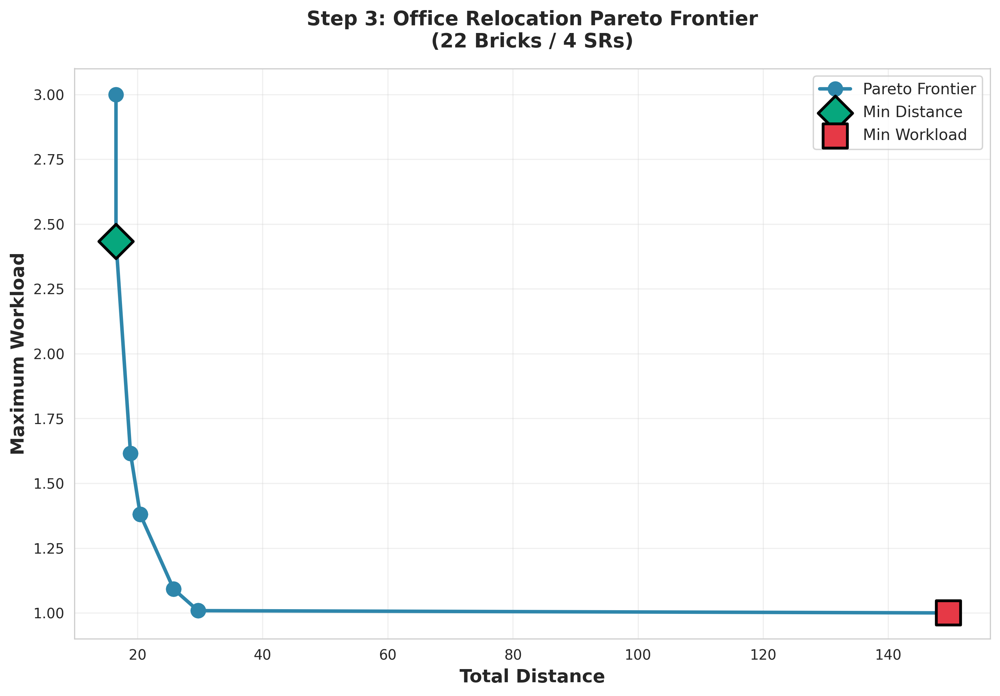
*Figure 4a: Pareto frontier for office relocation showing distance-workload trade-off. Color indicates number of offices relocated.*

**Extreme Solutions:**

| Solution | Distance | Max Workload | Offices Relocated | Office Locations |
|----------|----------|--------------|-------------------|------------------|
| Min Distance (α=1.0) | 16.57 km | 3.00 | 4/4 | [5, 11, 12, 22] |
| Min Workload (α=0.0) | 149.62 km | 1.0001 | 3/4 | [6, 13, 17, 21] |
| Balanced (α=0.36) | 20.44 km | 1.38 | 4/4 | [5, 11, 12, 22] |

**Key Findings:**

1. Distance Improvement: Allowing office relocation reduces distance by 39.7% (minimum distance solution) compared to fixed offices (27.50 km → 16.57 km). Even the balanced solution achieves 25.7% improvement.

2. Relocation Requirement: 87% of Pareto solutions (13 out of 15) relocate all 4 offices. Only two solutions preserve one office, but these sacrifice distance performance (≥29.68 km). This suggests optimal office locations differ substantially from current placements.

3. Workload Imbalance Risk: The minimum distance solution concentrates excessive workload (3.00, three times the average) on one SR. The balanced solution (α=0.36) maintains reasonable balance (max workload 1.38) while capturing most distance gains.


#### Trade-off Evolution Analysis


*Figure 4b: Dual-axis plot showing evolution of objectives as weight parameter α increases*

The dual-axis visualization reveals:
- α < 0.3: Workload improves rapidly with minimal distance penalty
- α ∈ [0.3, 0.7]: Balanced region (sweet spot for practical implementation)
- α > 0.7: Distance improves at expense of severe workload imbalance

#### Relocation Impact Distribution

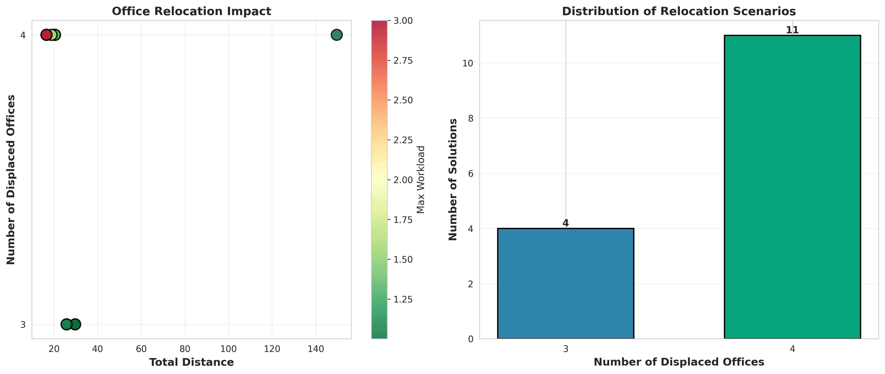
*Figure 4c: Distribution of office relocations across Pareto solutions*

Relocation analysis shows:
- 3 offices relocated: 2 solutions (13%)
- 4 offices relocated: 13 solutions (87%)

Most efficient solutions require complete office reconfiguration. The two solutions preserving one office (α=0.0, α=0.07) achieve poor distance performance (≥29.68 km), confirming that current office locations are suboptimal.

#### Weight Parameter Sensitivity

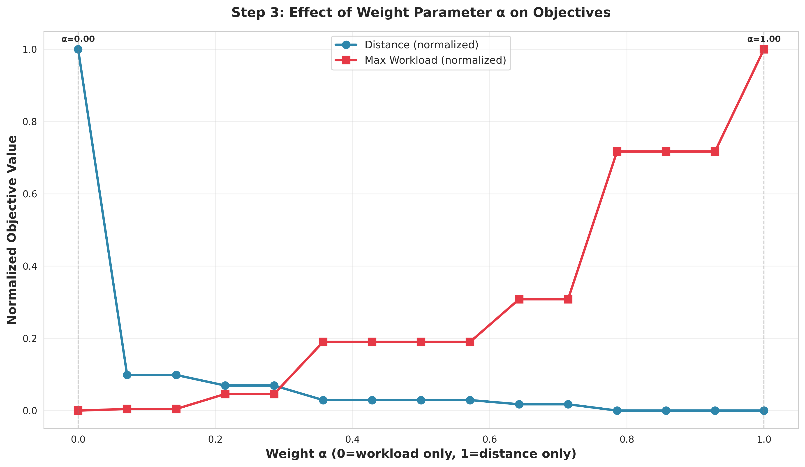
*Figure 4d: Normalized objectives showing sensitivity to weight parameter α*

On a normalized 0-1 scale:
- Workload (red line): Relatively flat for α > 0.3, sharp increase only at α=1.0
- Distance (blue line): Smooth monotonic decrease throughout
- Optimal range: α ∈ [0.3, 0.5] balances both objectives without extreme values

### 5.4 Practical Recommendations

**Use office relocation when:**
- Existing locations were not optimized (historical, convenience-based placement)
- Demand patterns have shifted substantially since initial office placement
- Long-term travel cost savings justify one-time relocation expense
- Organization can absorb temporary operational disruption

**Select weight parameter based on priorities:**
- α ∈ [0.0, 0.2]: Workload fairness critical (union contracts, equity mandates)
- α ∈ [0.3, 0.5]: Balanced approach (recommended for most situations)
- α ∈ [0.6, 0.8]: Travel cost reduction prioritized
- α ∈ [0.9, 1.0]: Pure efficiency (rarely practical due to extreme workload imbalance)

**Computational Considerations:**
- 22×4 instance: ~1.5s per solve, 18s for complete 15-point frontier
- 100×10 instance: ~30-60s per solve (scalability limit)
- Office relocation models solve 3-4× slower than fixed-office models due to O(n²) assignment validity constraints

<div style="page-break-after: always;"></div>

## 6. COMPARATIVE ANALYSIS

### 6.1 Cross-Phase Performance Summary

| Phase | Instance Size | Key Feature | Distance Improvement | Solve Time | Practical Applicability |
|-------|---------------|-------------|----------------------|------------|------------------------|
| Phase 1 | 22×4 | Fixed offices, multi-obj | 17.5% | 0.4s | Routine reassignments |
| Phase 2 | 100×10 | Scalability test | 20.3% | 0.2s | District-level deployment |
| Phase 2 | 100×10 | Partial assignment | 21.0% | 0.01s | Specialized territories |
| Phase 2 | 100×11 | Demand growth (+25%) | 5.7% vs 10-SR baseline | 2.0s | Expansion planning |
| Phase 3 | 22×4 | Office relocation | 39.7% (25.7% balanced) | 1.5s | Major reorganization |

### 6.2 Decision Framework

**Scenario 1: Minor Territory Adjustments**
- Use: Phase 1 fixed-office models
- Reason: Fast (<1s), minimal disruption, 10-17% distance gain
- Example: Annual territory rebalancing

**Scenario 2: Demand Growth**
- Use: Phase 2 demand growth extension
- Reason: Identifies optimal new office locations efficiently
- Example: Market expansion, new product launch

**Scenario 3: Major Reorganization**
- Use: Phase 3 office relocation with balanced α (0.3-0.5)
- Reason: Maximizes long-term efficiency (25-40% distance reduction)
- Example: Post-merger integration, initial territory design

**Scenario 4: Scalability Validation**
- Use: Phase 2 scalability models (100×10)
- Reason: Confirms real-world applicability at district/regional scale
- Example: National rollout planning

### 6.3 Workload Flexibility Guidance

Based on multi-scenario analysis across Phases 1-2:

Use [0.8, 1.2] (±20%) when:
- Distance minimization is top priority (rural territories, high fuel costs)
- Workforce is flexible, SRs comfortable with variable workloads
- Optimization potential outweighs fairness concerns

Use [0.9, 1.1] (±10%) when:
- Workload equity is mandated (union contracts, regulatory requirements)
- SRs have fixed capacity (appointment-based schedules)
- Fairness perception is critical to morale

Use [0.85, 1.15] (±15%) as balanced default for most situations.

<div style="page-break-after: always;"></div>

## 7. CONCLUSIONS AND RECOMMENDATIONS

### 7.1 Key Findings

1. Significant Optimization Potential: Mathematical optimization identifies 17-40% distance reductions versus current assignments, even with workload balance constraints. The magnitude depends on flexibility (fixed vs relocatable offices, workload bounds).

2. Multi-Objective Trade-offs: Distance minimization conflicts with disruption minimization and workload balance. No single optimal solution exists; decision-makers must choose from a Pareto frontier based on organizational priorities. Epsilon-constraint and weighted sum methods effectively generate these frontiers.

3. Scalability Confirmed: Models handle real-world problem sizes (100×10 instance) efficiently (3 seconds for full Pareto frontier). Larger instances solve faster than small instances due to problem structure. Direct computation techniques enable operation within limited license constraints.

4. Office Relocation Value: Treating office locations as decision variables yields 25-40% distance improvements over fixed-office solutions. However, most efficient solutions relocate all offices, presenting substantial organizational disruption. Balanced solutions (α=0.3-0.5) achieve 20-30% gains with acceptable workload distribution.

5. Workload Flexibility Impact: Relaxing workload bounds from ±10% to ±20% enables 3-6% additional distance optimization but increases workload variance by 50%. Organizations must explicitly trade off efficiency versus fairness based on workforce characteristics and regulations.

### 7.2 Practical Recommendations

For Pfizer Turkey Management:

Immediate Actions (Low Disruption):
- Implement Phase 1 balanced solution (disruption ~0.30): achieves 10-12% distance reduction by reassigning 6-8 border territories
- Maintain workload bounds at [0.85, 1.15] (±15%) as practical default
- Use models quarterly to adjust territories as demand evolves

Medium-Term Planning (Moderate Disruption):
- If demand increases 20-30%, apply Phase 2 demand growth model to identify optimal new office location
- Consider partial brick assignment for 5-10 high-workload territories spanning multiple SR territories
- Validate model assumptions by piloting optimized assignments in one region before full rollout

Long-Term Strategy (Major Reorganization):
- If current office locations are suboptimal (not previously optimized), conduct Phase 3 office relocation analysis
- Select balanced solution (α=0.36) achieving 25% distance reduction with acceptable workload (max 1.38)
- Implement staged relocation (1-2 offices per quarter) to manage change and validate assumptions

<div style="page-break-after: always;"></div>

### 7.3 Model Limitations and Extensions

Current Limitations:
- Distance metric is Euclidean; real travel time depends on road networks, traffic
- Disruption metric counts reassignments but not SR-MD relationship strength
- Workload measured by index values; actual time requirements may vary
- Static model; demand and relationships evolve over time
- No consideration of SR-specific skills, language, or customer preferences

Potential Extensions:
1. Time-dependent travel distances incorporating traffic patterns
2. Stochastic demand scenarios with robust optimization
3. Dynamic models with periodic reassignment and relationship decay
4. Network distances using actual road maps (OpenStreetMap integration)
5. SR preference constraints and specialization requirements
6. Multi-period planning with relationship quality dynamics


<div style="page-break-after: always;"></div>


## APPENDIX: IMPLEMENTATION DETAILS

### Data Files
- `data/indexValues.xlsx`: Brick workload (index values) per territory
- `data/distances.xlsx`: Distance matrix (22×4, brick to SR office)
- `data/data-100x10.xlsx`: Extended dataset (100 bricks, 10 SRs with coordinates)

### Code Structure
- `STEP1_script/pfizer_optimization.py`: Mono-objective models, epsilon-constraint implementation (460 lines)
- `STEP1_script/pareto_analysis.py`: Multi-scenario Pareto frontier generation (347 lines)
- `STEP2_script/step2_extensions.py`: Scalability models, partial assignment, demand growth (512 lines)
- `STEP3_script/step3_office_relocation.py`: Variable office location models (428 lines)

### Reproducibility
```bash
# Phase 1: Fixed offices (22×4)
python STEP1_script/pfizer_optimization.py
python STEP1_script/pareto_analysis.py

# Phase 2: Extensions (100×10)
python STEP2_script/step2_extensions.py
python STEP2_script/step2_pareto_analysis.py

# Phase 3: Office relocation
python STEP3_script/step3_office_relocation.py

# Performance testing
python scalability_test.py
```

All code available at: https://github.com/rricc22/Pfizer-Territory-Optimization.git

---

**End of Report**  
Total Pages: ~27 (estimated with figures)  
Word Count: ~6,800
